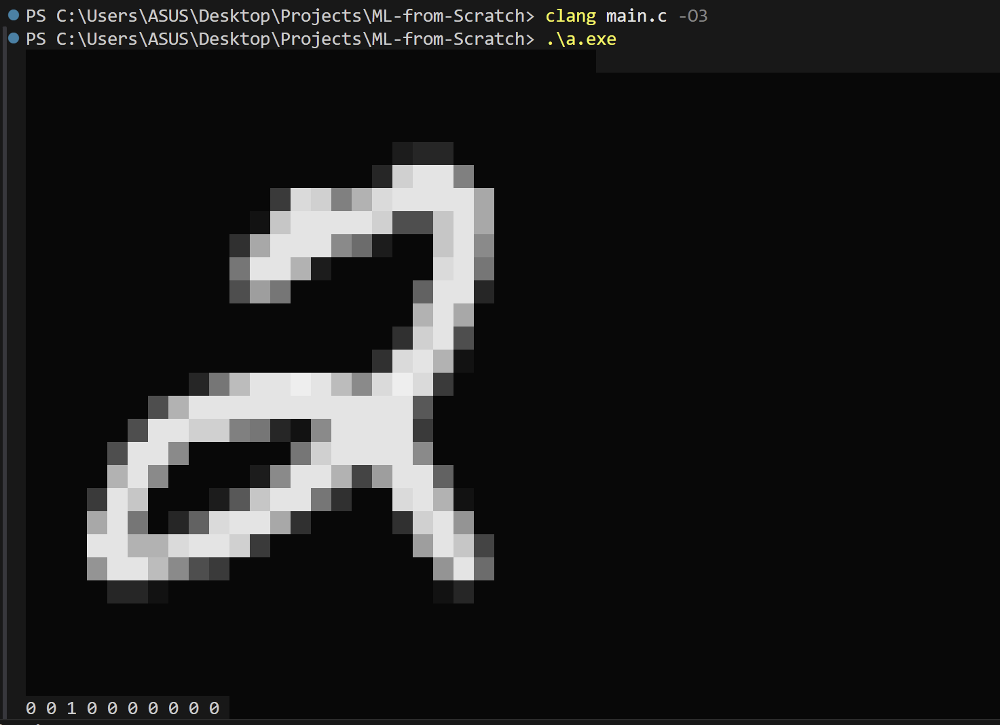
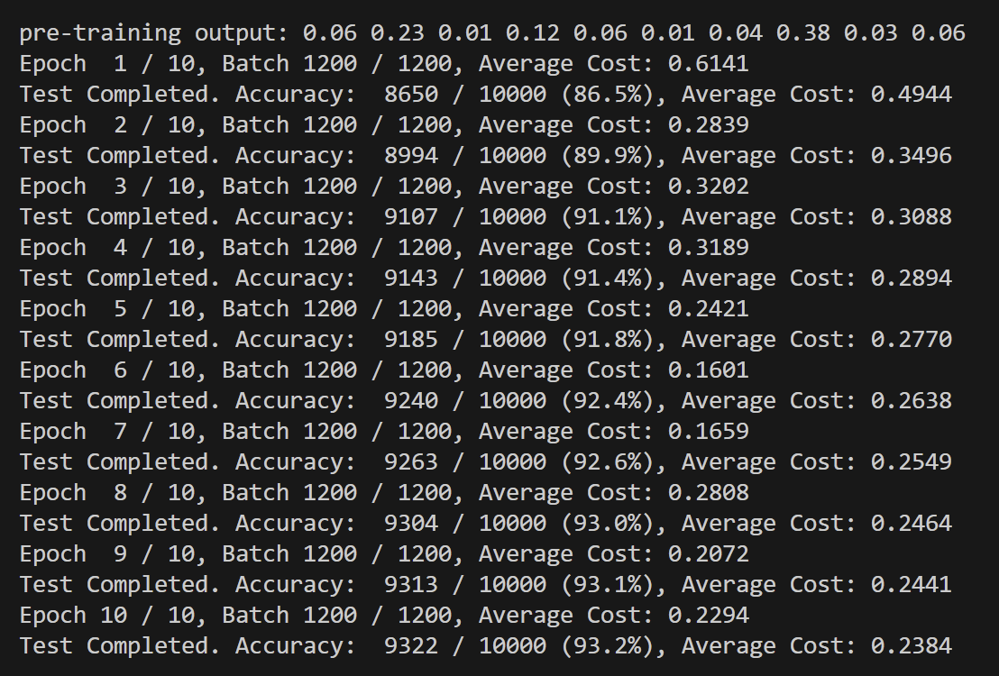
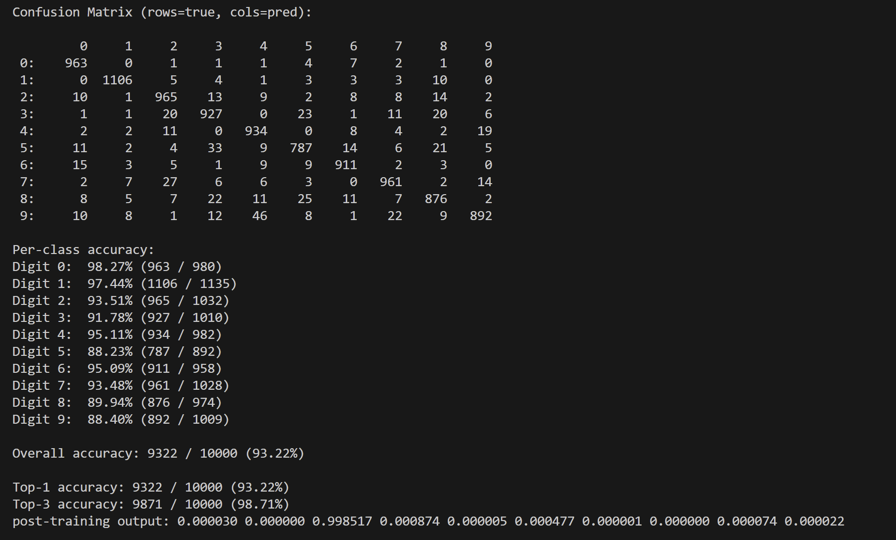

# MNIST From Scratch in C

## Original Source / Inspiration 

This project was inspired by the work of:

Ian Dvorin (Magicalbat) - https://github.com/Magicalbat

I used his general approach and coding style as a learning reference while building and organizing my own version of the project in this repository.

---

## Why I Built This

This is my first serious machine learning project implemented from scratch in C.

My goal was to understand the full pipeline behind ML libraries (like PyTorch or TensorFlow) by implementing the core ideas manually, including:

- how data is represented in memory
- how matrix operations work internally
- how forward pass computations are executed
- how gradients are computed through backpropagation
- how training updates parameters over time

This repository documents my learning process in low-level programming and machine learning fundamentals.

---

## What This Project Does

This repository implements an MNIST digit classifier in C, including:

- Custom matrix data structure (row-major storage)
- Matrix operations (addition, subtraction, multiplication, scaling)
- Activation functions (ReLU, softmax)
- Cross-entropy loss
- Forward pass + backward pass (backpropagation)
- Training loop over epochs and batches
- Evaluation with accuracy metrics and a confusion matrix
- ASCII visualization of MNIST digits in the terminal

---

## Results

This implementation trains successfully and reaches:

- Overall Accuracy: 93.22% (9322 / 10000)
- Top-3 Accuracy: 98.71% (9871 / 10000)

### MNIST Digit Visualization (ASCII Output)



### Training Progress Output



### Confusion Matrix + Per-Class Accuracy



Per-class accuracy (from the output):

- Digit 0: 98.27% (963 / 980)
- Digit 1: 97.44% (1106 / 1135)
- Digit 2: 93.51% (965 / 1032)
- Digit 3: 91.78% (927 / 1010)
- Digit 4: 95.11% (934 / 982)
- Digit 5: 88.23% (787 / 892)
- Digit 6: 95.09% (911 / 958)
- Digit 7: 93.48% (961 / 1028)
- Digit 8: 89.94% (876 / 974)
- Digit 9: 88.40% (892 / 1009)

---

## My Contributions

Even though the original inspiration and implementation style came from Ian Dvorin (Magicalbat), my work in this repository reflects my learning-focused implementation, project setup, and documentation.

My contributions include:

### 1) Project setup and repository organization
I created a clean, runnable project structure with the key source files needed to build and run the program.

### 2) Integrated a custom memory arena allocator
This project uses a custom memory arena system (`arena.c / arena.h`) to handle fast allocations and reduce heap overhead.  
It includes:

- reserve/commit allocation model
- push/pop allocation interface
- temporary arenas
- scratch arenas for intermediate computations

### 3) Implemented dataset export pipeline
I used Python (`mnist.py`) to download MNIST and export it into raw binary files for the C training program:

- `train_images.mat`
- `train_labels.mat`
- `test_images.mat`
- `test_labels.mat`

This makes the C program independent from Python after the dataset is exported.

### 4) GitHub-ready cleanup (.gitignore)
I added `.gitignore` rules to avoid committing unnecessary or generated files such as:

- compiled binaries (`*.exe`, `*.out`)
- object files (`*.o`)
- generated dataset binaries (`*.mat`)
- editor folder (`.vscode/`)

---

## Files Overview

- `main.c`  
  The MNIST classifier implementation, training loop, and evaluation.

- `arena.c` / `arena.h`  
  Custom memory arena allocator used throughout the program.

- `prng.c` / `prng.h`  
  Random number generator for initialization.

- `base.h`  
  Common types and macros (alignment helpers, MIN/MAX, KiB/MiB/GiB).

- `mnist.py`  
  Downloads MNIST and exports raw binary `.mat` files.

---

## How To Run

### 1) Generate MNIST `.mat` files (Python)

Install dependencies:
```bash
pip install numpy tensorflow-datasets
```

Run:
```bash
python mnist.py
```

This generates:
* `train_images.mat`
* `train_labels.mat`
* `test_images.mat`
* `test_labels.mat`

### 2) Compile (C)

Using clang:
```bash
clang main.c -O3 -lm
```

Or using gcc:
```bash
gcc main.c -O3 -lm
```

### 3) Run

On Linux / macOS:
```bash
./a.out
```

On Windows (PowerShell):
```bash
.\a.exe
```

You should see:
* ASCII visualization of an MNIST digit
* predictions before training
* training progress across epochs and batches
* predictions after training
* confusion matrix and per-class accuracy

---

## Notes

* This is an educational project and may not be optimized for production ML performance.
* The goal is to understand low-level ML mechanics in C.
* Credit is provided above for the original inspiration source.

---

## License

This repository includes an MIT License file.

Original inspiration credited to: Ian Dvorin (Magicalbat) — https://github.com/Magicalbat
